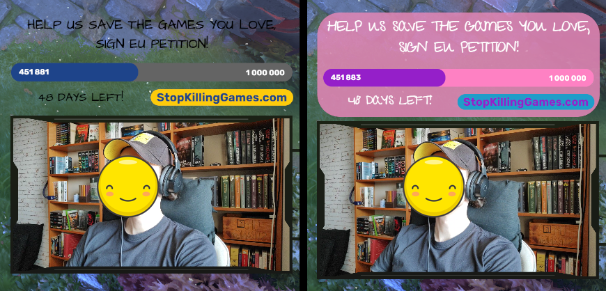

# Stop Killing Games overlay
Stop Killing Games initiative petition stream overlay. I am not associated with any organizers of Stop Killing Games.

## About
Stream overlay tracking the current signature count of Stop Killing Games EU petition. Created in Streamelement. 
Almost fully customizable in Streamelements editor UI, text, fonts, sizes, colors, backgrounds.
- choose, if to make the overlay blend in or flashy

## Installation
Both installation methods require you to have Streamelements account and be logged in your account.

### 1. Direct link
Click on the link below or copy and paste the URL to the browser address bar. 
You will be redirected to your Streamelements overlay page with "Stop Killing Games Overlay (unofficial)" already imported.

<a href="https://streamelements.com/dashboard/overlays/share/685014487d511fdc08946009" target="_blank">https://streamelements.com/dashboard/overlays/share/685014487d511fdc08946009</a>
